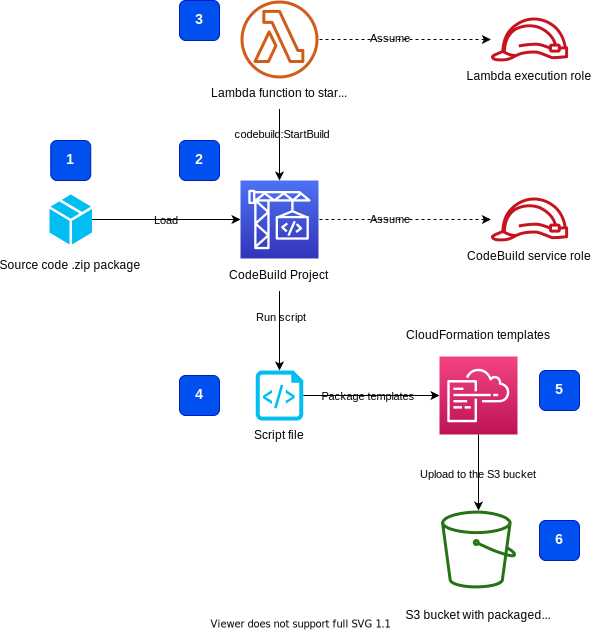
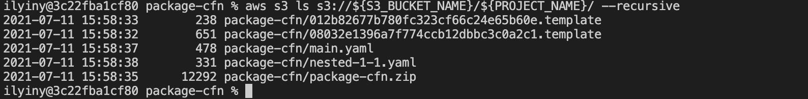
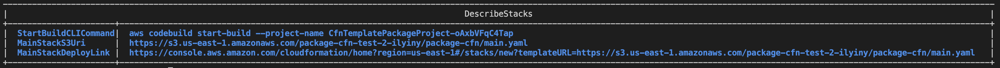

# Package CloudFormation templates
This solution provides a framework and working sample code to handle packaging and upload of [AWS CloudFormation](https://aws.amazon.com/cloudformation) templates to an [Amazon Simple Storage System](https://aws.amazon.com/s3) (Amazon S3) bucket before deployment. This is useful when you have a complex deployment with multiple nested CloudFormation templates. The benefits of this [AWS CodeBuild](https://aws.amazon.com/codebuild/)-based approach:

- You deliver your solution's source code "as is", without pre-packaged CloudFormation templates
- Packaging and upload process runs in CodeBuild environment which you can configure and control, rather than on the end-user workstation
- Decreasing dependency on the end-user environment, operating system, and installed programs
- You can implement complex workflow for the pre- and post-deployment steps using CodeBuild and [CodePipeline](https://aws.amazon.com/codepipeline)
- Improving end-user experience with error-free and repeatable deployment workflows

This solution offers two options how you can perform this deployment preparation step.

## Solution architecture



1. zip-file with full source code is copied to the S3 deployment bucket 
2. CodeBuild project
3. Lambda function starts the CodeBuild project build
4. Script file contains all packaging and uploading commands
5. Packaged CloudFormation templates
6. S3 bucket where the package CloudFormation templates are copied


## Option 1 - use a CloudFormation template to package and upload
This option first deploys a simple CloudFormation template [`package-cfn.yaml`](package-cfn.yaml). The template creates a CodeBuild project which packages and uploads the deployment templates into the specified S3 bucket.

To follow along with the deployment instructions, run the following commands in your terminal (all commands were tested for macOS 10.15.7, but the will work on Windows as well).

1. Clone the GitHub repository:
```sh
git clone https://github.com/aws-samples/aws-codebuild-cfn-package.git
cd aws-codebuild-cfn-package
```

2. If you do not have an S3 bucket, you must create a brand new one. **Skip this step if you already have an S3 bucket**.
```sh
S3_BUCKET_NAME=<your new S3 bucket name>
aws s3 mb s3://${S3_BUCKET_NAME} --region $AWS_DEFAULT_REGION
```

3. Upload the source code zip file `package-cfn.zip` to the S3 bucket:
```sh
S3_BUCKET_NAME=<your existing or just created S3 bucket name>
PROJECT_NAME=<name of your proejct>
aws s3 cp package-cfn.zip s3://${S3_BUCKET_NAME}/${PROJECT_NAME}/
```

4. Deploy the CloudFormation template:
```sh
aws cloudformation deploy \
        --template-file package-cfn.yaml \
        --stack-name $PROJECT_NAME-package-cfn \
        --capabilities CAPABILITY_NAMED_IAM \
        --parameter-overrides \
        S3BucketName=$S3_BUCKET_NAME \
        ProjectName=$PROJECT_NAME \
        SourceCodeZipFileName=package-cfn.zip
```

5. Wait until deployment has finished and print the stack outputs with the following command (you may wait couple of minutes before the templates appear in the S3 bucket):
```sh
aws cloudformation describe-stacks \
    --stack-name $PROJECT_NAME-package-cfn \
    --output table \
    --query "Stacks[0].Outputs[*].[OutputKey, OutputValue]"
```

📜 **Save it to your scratch pad for later use.**

6. Check that the deployment templates are uploaded into the S3 bucket:
```sh
aws s3 ls s3://${S3_BUCKET_NAME}/${PROJECT_NAME}/ --recursive
```



Now all deployment CloudFormation templates are packaged and uploaded to your S3 bucket. You can proceed with the deployment steps. 

### Pre-defined deployment links
You can create pre-defined deployment links for your end-users. The `package-cfn` stack creates three sample links:


- `StartBuildCLICommand`: end-users can start the CodeBuild project via this CLI command
- `MainStackS3Uri`: end-users can use this S3 URI to deploy the specified stack in the CloudFormation AWS console
- `MainStackDeployLink`: end-users can copy-past this link into a browser to open the CloudFormation AWS Console with a pre-populated template S3 URI

You can create additional links based on your deployment requirements and structure.

### Clean up
To delete the packaging and upload stack, run the following command:
```sh
aws cloudformation delete-stack --stack-name $PROJECT_NAME-package-cfn
```

## Option 2 - use a shell script to package and upload
If you use macOS/Linux you can run the delivered packaging script via `make` command. This script **will not** work on Windows.

Run the following command to package and upload the deployment templates into your S3 bucket. You can specify either a name for an existing S3 bucket or a new name (an S3 bucket will be created for you). If you use the existing S3 bucket, it must be in **the same region** where you are deploying the CloudFormation templates.

```sh
S3_BUCKET_NAME=<your existing or new Amazon S3 bucket name>
make package CFN_BUCKET_NAME=$S3_BUCKET_NAME DEPLOYMENT_REGION=$AWS_DEFAULT_REGION
```

Run the `ls` on the S3 bucket to check that all templates are uploaded:
```sh
aws s3 ls s3://${S3_BUCKET_NAME}/${PROJECT_NAME}/ --recursive
```

Copyright Amazon.com, Inc. or its affiliates. All Rights Reserved.
SPDX-License-Identifier: MIT-0